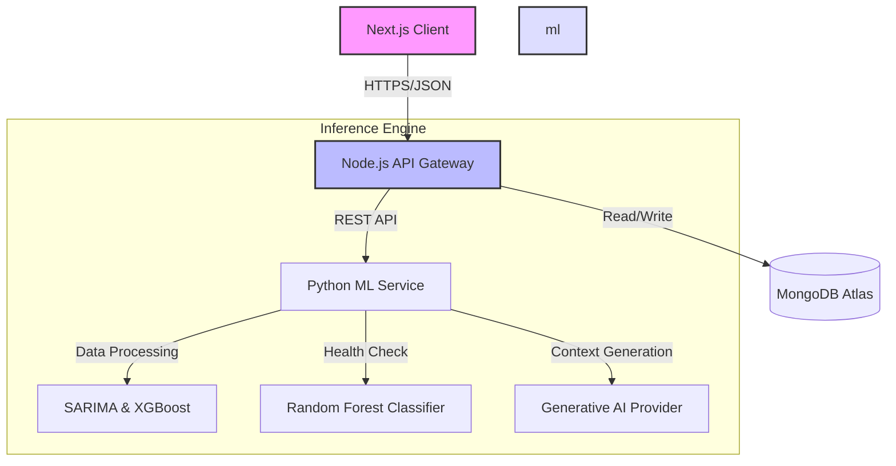
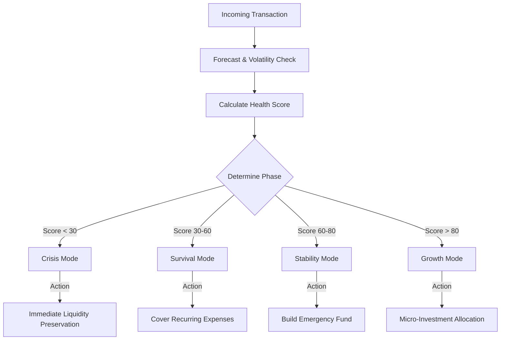

# AI-Driven Risk Aware Micro-Investing Framework for Gig Economy

## Introduction

This documentation details the **AI-Driven Risk Aware Micro-Investing Framework**, a comprehensive solution designed to address financial instability in the gig economy. The system transforms irregular income streams into actionable financial stability through predictive modeling and an automated decision engine. By leveraging Time-Series Forecasting (SARIMA) and Explainable AI (LLMs), the framework acts as an autonomous financial advisor for gig workers.

## Project Scope

The gig economy is characterized by high income volatility (30-50% monthly variance) and a lack of traditional financial safety nets. This project aims to:
1.  **Forecast Income**: utilizing historical data to predict near-term earnings.
2.  **Assess Risk**: Generating real-time financial health scores based on debt, savings, and expenditure.
3.  **Allocate Funds**: Dynamically routing surplus income into emergency funds, debt repayment, or micro-investments based on a strict priority hierarchy.

## System Architecture

The application implements a microservices-based architecture to decouple reliable financial transaction processing from resource-intensive machine learning tasks.



## Technology Stack

### Frontend
-   **Framework**: Next.js (React) for server-side rendering and static optimization.
-   **Component Library**: shadcn/ui for accessible, consistent design patterns.
-   **State Management**: React Context API for application-levle state.

### Backend
-   **Runtime**: Node.js with Express.js for scalable API endpoint management.
-   **Database**: MongoDB (Mongoose ODM) for flexible document storage of heterogeneous financial data.

### Machine Learning
-   **Language**: Python 3.9+
-   **Forecasting**: statsmodels (SARIMA), xGBoost.
-   **Classification**: scikit-learn (Random Forest).
-   **Explainability**: Integration with LLM APIs (Gemini/OpenAI) for natural language reasoning.

## Logic Flow

The core decision-making process follows a deterministic hierarchy to ensure financial safety.



## Installation and Setup

### Prerequisites
-   **Node.js**: Version 18.0.0 or higher.
-   **Python**: Version 3.9 or higher.
-   **MongoDB**: Local instance or Atlas connection string.

### 1. Clone the Repository
```bash
git clone https://github.com/organization/gig-economy-investing-framework.git
cd gig-economy-investing-framework
```

### 2. Frontend Configuration
```bash
cd frontend
# Install dependencies
npm install

# Start development server
npm run dev
```
The frontend will be available at `http://localhost:3000`.

### 3. Backend Configuration
```bash
cd ../backend
# Install dependencies
npm install

# Configure environment variables
cp .env.example .env
# Edit .env to include your MONGODB_URI

# Start backend server
npm run start
```
The API server will run on `http://localhost:5000`.

### 4. Machine Learning Service
```bash
cd ../ml
# Create virtual environment
python -m venv venv
source venv/bin/activate  # On Windows use: venv\Scripts\activate

# Install requirements
pip install -r requirements.txt

# Start Flask inference service
python app.py
```

## Contributing
Please refer to `CONTRIBUTING.md` for coding standards and pull request guidelines.

## License
MIT License
