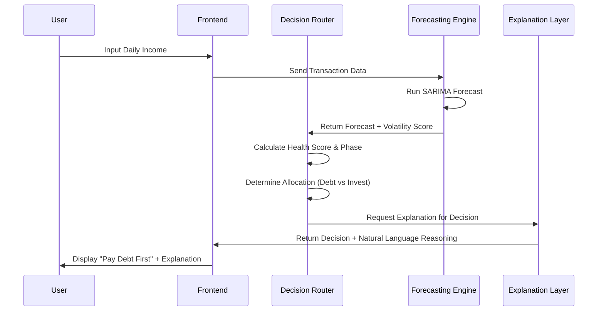

# System Modules

This document outlines the six functional modules that comprise the **Smart Decision Router** and user journey. Each module represents a distinct logical component within the application architecture.

## Module 1: User Onboarding and Data Ingestion
**Responsibility**: Transitioning the user from authentication to a data-ready state.
-   **Authentication**: Secure login via OAuth 2.0 (Google) or standard email/password.
-   **Data Harvesting**:
    -   Collection of baseline financial metrics (Current Balance, Outstanding Debt).
    -   Ingestion of historical transaction logs via CSV upload or manual entry wizard.
    -   categorization of recurring expenses (Rent, Utilities, Subscriptions).

## Module 2: Income Analysis and Forecasting Engine
**Responsibility**: Predicting future cash flow to mitigate volatility risk.
-   **Forecasting**: usage of **SARIMA** (Seasonal Auto-Regressive Integrated Moving Average) models to predict income for 15-day and 30-day windows.
-   **Volatility Scoring**: Classification of income stability into three tiers:
    1.  **Stable**: Variance < 10%
    2.  **Semi-Volatile**: Variance 10-30%
    3.  **Highly Volatile**: Variance > 30%
-   **Anomaly Detection**: Identification of statistical outliers (e.g., unexpected windfalls or complete income cessation) using Z-score analysis.

## Module 3: Financial Health Scoring System
**Responsibility**: Quantifying the user's financial stability into a normalized metric.
-   **Algorithm**: Weighted aggregate of multiple sub-scores:
    -   *Debt-to-Income Ratio* (30%)
    -   *Liquidity Coverage* (40%)
    -   *Expense Consistency* (30%)
-   **Output**: A scalar value (0-100) determining the user's operational phase (Crisis, Survival, Stability, Growth).

## Module 4: Smart Decision Router
**Responsibility**: The central logic engine enforcing financial discipline.
-   **Logic**: A rules-based system that prioritizes capital allocation.
-   **Sequence**:
    1.  **Mandatory**: Cover upcoming recurring expenses (predicted via Module 2).
    2.  **Safety**: Fill Emergency Fund bucket until it covers 3 months of expenses.
    3.  **Liability**: Allocate surplus to highest-interest debt (Avalanche Method).
    4.  **Growth**: Only after steps 1-3 are satisfied, route remaining funds to investments.

## Module 5: Micro-Investment Suggestion Engine
**Responsibility**: Generating safe, risk-adjusted investment opportunities.
-   **Constraint Checking**: Verifies that the user is in the 'Growth' phase.
-   **Asset Allocation**: Recommends conservative instruments suitable for short-term liquidity:
    -   Liquid Mutual Funds
    -   Overnight Funds
    -   Digital Gold (optional)
-   **ROI Simulation**: Projects potential returns over 3, 6, and 12-month horizons to incentivize participation.

## Module 6: Explanatory AI Layer
**Responsibility**: Bridging the gap between algorithmic decisions and human understanding.
-   **Contextualization**: Ingests the raw outputs from Modules 2, 3, and 5.
-   **Generation**: Uses Large Language Models (LLMs) to construct a narrative explanation.
    -   *Input*: "Router blocked investment. Emergency Fund at 10% target."
    -   *Output*: "We cannot recommend investing yet because your emergency fund is low. Building this safety net prevents you from needing high-interest loans in the future."
-   **Caching**: Stores explanations to reduce API costs and latency for recurring similar states.

## Module Interaction Diagram

